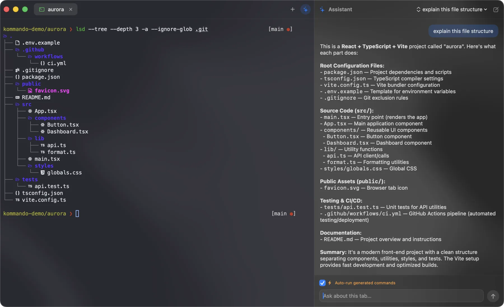

<div align="center">
  
  <h1>Kommando</h1>
  <p><strong>A fast, native macOS terminal — split panes, tabs, and an AI sidebar, built in SwiftUI.</strong></p>
  <p>
    <a href="https://kommando.app"><strong>🌐 kommando.app</strong></a>
  </p>
</div>

<br />

<div align="center">
  <a href="https://kommando.app">
    
  </a>
</div>

## Features

- **Split panes** — tile terminals horizontally and vertically; new panes distribute evenly and inherit the current directory.
- **Tabs** — scrollable tab bar with titles that track the focused pane's folder.
- **AI sidebar (BYOK)** — a streaming assistant with tool-calling that can read the focused pane's output and insert/run commands. Bring your own Anthropic or OpenAI key (stored in the macOS Keychain).
- **Quick AI prompt** — `⌃↩` overlay to turn a request into a shell command.
- **Custom commands** — map your own hotkeys to shell commands (e.g. `⌘K` → `clear`) and run them without clobbering half-typed input.
- **Customizable shortcuts** — rebind new tab, pane navigation, splits, AI panel, and more.
- **Search** — `⌘F` in-terminal find with match highlighting.
- **Session restore** — reopens your tabs, pane layout, and working directories on launch.
- **Font zoom** — `⌘+` / `⌘-` / `⌘0`.
- **Theming** — Dark / Light / System, with a translucent native window and Nerd Font icon rendering.
- **JS Inspector** — an optional JavaScript REPL tab and inline JSON inspection of terminal output.

## Requirements

- macOS 26 (Tahoe) or later
- Apple Silicon
- Xcode 26+ to build

## Build & run

```bash
git clone https://github.com/christianalares/kommando.git
cd kommando
open Kommando.xcodeproj
```

Then build & run (`⌘R`) in Xcode. Dependencies (SwiftTerm) are resolved automatically via Swift Package Manager.

## Installing a build (for testers)

Kommando is currently **ad-hoc signed** (not notarized), so macOS Gatekeeper will warn on first launch. After moving `Kommando.app` to `/Applications`, clear the quarantine flag once:

```bash
xattr -dr com.apple.quarantine /Applications/Kommando.app
```

…or right-click the app → **Open** → **Open**.

## Built with

- [SwiftUI](https://developer.apple.com/xcode/swiftui/) + AppKit
- [SwiftTerm](https://github.com/migueldeicaza/SwiftTerm) for terminal emulation
- JavaScriptCore for the Inspector REPL
